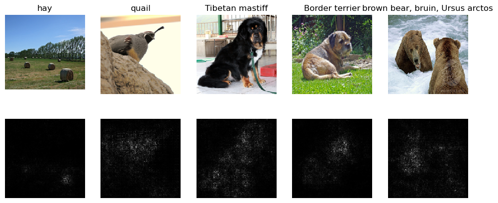

# Neural Network Visualizations
This project implements visualization techniques to interpret and analyze the decision-making processes of convolutional neural networks. By leveraging these visualizations we can gain a better understanding of the inner workings and limitations of CNN’s.

## Visualization Techniques

### 1. Saliency Map

* Description: Highlights the most important pixels in an input image that contribute to the model's prediction.
* Purpose: Offers a global view of which parts of an image are most critical for decision-making.
* Insights: Helps identify whether the model is focusing on relevant features or irrelevant noise.

### 2. Grad-CAM (Gradient-weighted Class Activation Mapping)
* Description: Uses the gradients of a specific class's score to generate a heatmap of important regions in a convolutional layer.
* Purpose: Provides class-specific visualizations, showing which regions of the image the model considers important for predicting a given class.
* Insights: Useful for debugging misclassifications and understanding class-wise feature attribution.

### 3. Guided Backpropagation
* Description: Combines backpropagation and ReLU activations to visualize positive contributions of input features to the output.
* Purpose: Delivers fine-grained, high-resolution visualizations of image features influencing the prediction.
* Insights: Helps examine low-level details in images, revealing how specific features contribute to decisions.

### 4. Fooling Images
* Description: Generates images that are unrecognizable to the human eye but cause the model to confidently misclassify them.
* Purpose: Explores model vulnerability to adversarial attacks and evaluates robustness.
* Insights: Demonstrates limitations in generalization and helps develop defense mechanisms against adversarial inputs.

### 5. Style Transfer
* Description: Applies the style of one image (e.g., a painting) to the content of another image, leveraging neural networks to blend features.
* Purpose: Highlights the network’s ability to disentangle content and style representations.
* Insights: Useful for artistic applications and understanding feature abstraction in convolutional layers.

### 6. Class Model Visualization
* Description: Synthesizes images that maximize the activation of a specific class in the network.
* Purpose: Visualizes what the model perceives as the “essence” of a class.
* Insights: Provides insight into the learned representations and feature hierarchies in the model.

## Usage 
### Prerequisites
* Python 3.8 or higher.
* Required libraries: TensorFlow, PyTorch, NumPy, Matplotlib, OpenCV, scipy

