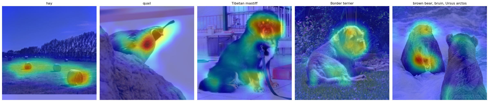
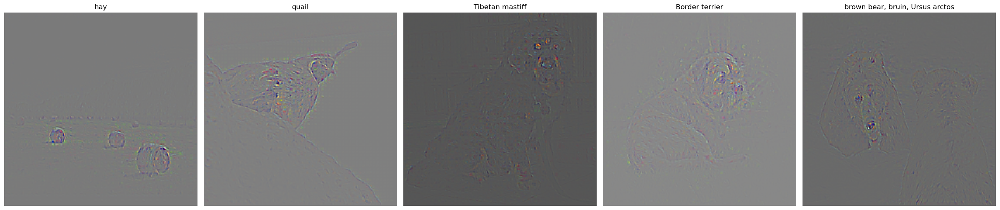
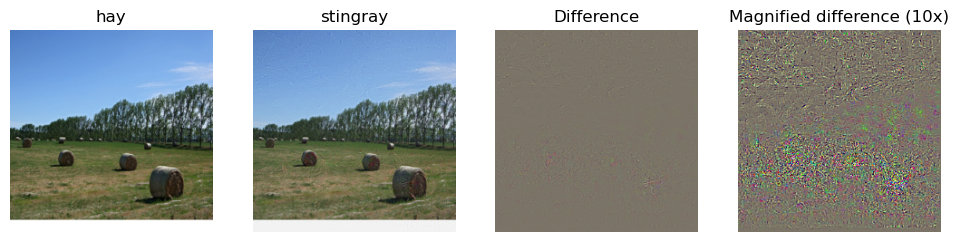
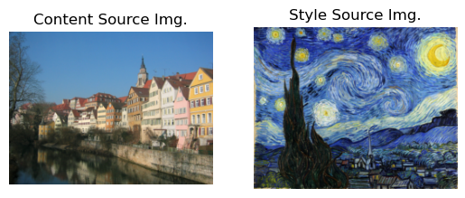
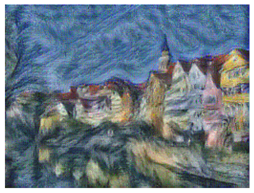
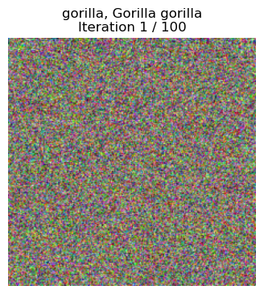

# Neural Network Visualizations
This project implements visualization techniques to interpret and analyze the decision-making processes of convolutional neural networks. By leveraging these visualizations we can gain a better understanding of the inner workings and limitations of CNN’s.

## Visualization Techniques

### 1. Saliency Map

* Highlights the pixels in an input image that contribute the most to the model's prediction, offering a view of which parts of an image are most critical for the model's decision-making.
* Helps to identify whether the model is focusing on relevant features or irrelevant noise.

### 2. Grad-CAM (Gradient-weighted Class Activation Mapping)

* Uses the gradients of a specific class's score to generate a heatmap of important regions in a convolutional layer.
* Provides class-specific visualizations, showing which regions of the image the model considers important for predicting a given class. Useful for debugging misclassifications and understanding class-wise feature attribution.

### 3. Guided Backpropagation

* Combines backpropagation and ReLU activations to visualize positive contributions of input features to the output, delivering fine-grained visualizations of image features influencing the prediction.
* Helps examine low-level details in images, revealing how specific features contribute to decisions.

### 4. Fooling Images

* Generates images that are unrecognizable to the human eye but cause the model to confidently misclassify them, exploring model vulnerability to adversarial attacks and evaluate robustness.
* Demonstrates limitations in generalization and helps develop defense mechanisms against adversarial inputs.

### 5. Style Transfer


* Applies the style of one image to the content of another image, leveraging neural networks to blend features, highlighting the network’s ability to disentangle content and style representations.
* Useful for artistic applications and understanding feature abstraction in convolutional layers.

### 6. Class Model Visualization

* Synthesizes images that maximize the activation of a specific class in the network to visualizes what the model perceives as the “essence” of a class, provides insight into the learned representations and feature hierarchies in the model.

## Usage 
### 1. Prerequisites
Ensure you have the following installed:
* Python 3.8 or higher.
* Required libraries: TensorFlow, PyTorch, NumPy, Matplotlib, OpenCV, scipy, captum, TorchVision

### 3. Running Visualizations
You can generate visualizations by running the corresponding scripts:
Saliency Map : ```python saliency_map.py```
GradCam and Guided Back Prop: ```python gradcam.py```
Style Transfer: ```python style_transfer.py```
Fooling Image: ```python fooling_image.py```


